<div align="center">

# SpectralGuard

**Detecting Memory Collapse Attacks in State Space Models**

[](https://arxiv.org/abs/2026.XXXXX)
[](https://www.python.org)
[](LICENSE)
[](https://huggingface.co/spaces/DaviBonetto/spectralguard-demo)
[](https://huggingface.co/datasets/DaviBonetto/spectralguard-dataset)
[]()
[](https://github.com/psf/black)

[**Paper**](paper/paper.pdf) · [**Quickstart**](#quickstart) · [**Experiments**](#experiment-matrix) · [**Public API**](#public-api)

</div>

---

State Space Models (SSMs) such as **Mamba** achieve linear-time sequence processing through input-dependent recurrence, but this mechanism introduces a critical safety vulnerability: **Spectral Collapse**. We show that the spectral radius $\rho(\bar{A})$ of the discretized transition operator governs the effective memory horizon. When an adversary drives $\rho$ toward zero through gradient-based Hidden State Poisoning, memory collapses from millions of tokens to mere dozens, silently destroying reasoning capacity without triggering output-level alarms.

We prove an **Evasion Existence Theorem** demonstrating that for *any* output-only defense, adversarial inputs exist that simultaneously induce spectral collapse and evade detection. We then introduce **SpectralGuard**, a real-time monitor that tracks spectral stability across all model layers, achieving F1 = 0.961 against non-adaptive attackers and retaining F1 = 0.842 under the strongest adaptive setting, with sub-15ms per-token latency.

## The Vulnerability: Spectral Collapse

In architectures like Mamba, information is compressed into a $d$-dimensional hidden state $h_t \in \mathbb{R}^d$, updated at every token via a discretized transition operator $\bar{A}_t = \exp(\Delta_t A)$. The retention of this memory is mathematically bounded by the **spectral radius**:

$$\rho(\bar{A}_t) = \max_{i=1,\dots,d} |\lambda_i(\bar{A}_t)|$$

When $\rho(\bar{A}_t) \approx 1$, the model operates in a near-critical regime where information persists across long sequences. When $\rho(\bar{A}_t) \to 0$, the state norm decays geometrically as $\|h_t\| \le \kappa \cdot \rho^t \cdot \|h_0\|$, contracting exponentially and wiping the model's memory in just a few tokens.

Unlike Transformers, which distribute information across an explicit key-value cache with additive attention aggregation, SSMs multiply by $\bar{A}_t$ at every recurrent step. This creates a **compounding** attack surface: a small adversarial shift in $\Delta_t$ cascades exponentially through recurrence—for example, $0.3^{10} \approx 6 \times 10^{-6}$—obliterating internal state information before any output-level alarm can fire.

### Theorem 1: The Spectral Horizon Bound

We formalize memory capacity through the effective memory horizon $H_{\text{eff}}$, proving it is tightly bounded by the spectral radius, the condition number $\kappa(\bar{A})$, and the Controllability Gramian $\mathcal{W}_c$:

$$H_{\text{eff}} \le \frac{\log\left( \kappa(\bar{A}) \sqrt{\frac{\|h_0\|_2^2}{\varepsilon^2 \lambda_{\max}(\mathcal{W}_c)}} \right)}{\log(1/\rho(\bar{A}))}$$

In the near-critical regime where $\rho(\bar{A}) = 1 - \eta$ with $\eta \ll 1$, this simplifies to $H_{\text{eff}} \lesssim \log(\kappa/\varepsilon)/\eta = O(1/\eta)$, revealing a sharp dependence: a 1% drop in $\rho$ (e.g., $0.99 \to 0.98$) doubles the denominator, **halving the effective memory horizon**. Our experiments confirm a phase transition at $\rho_{\text{critical}} \approx 0.90$, where accuracy collapses from >80% to <30%.

<div align="center">
<br>
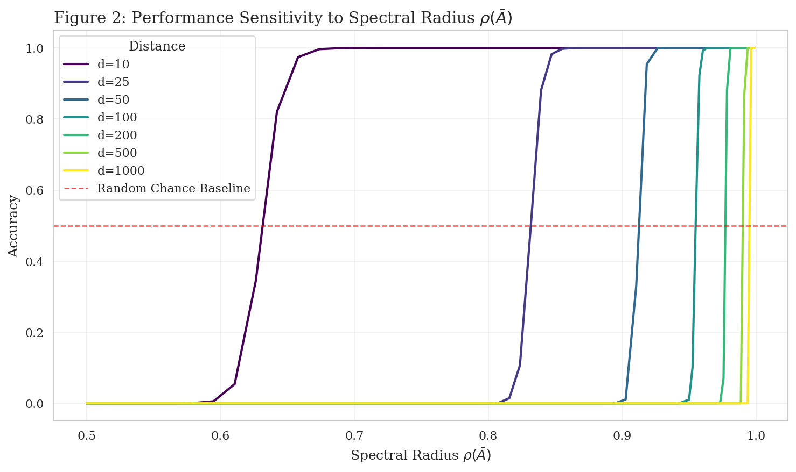
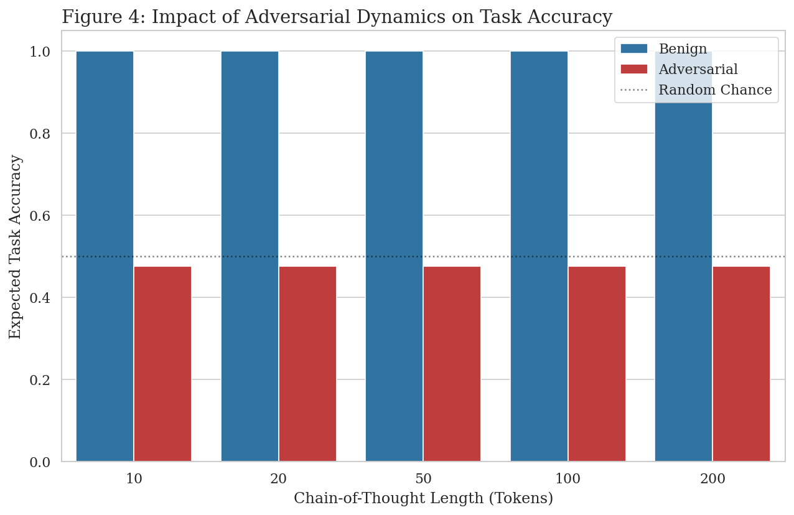
<br><em>The Spectral Phase Transition in Mamba-130M (N=500). Left: accuracy as a function of spectral radius, revealing a sharp collapse at ρ ≈ 0.90. Right: accuracy stratified by context distance and spectral regime (r = 0.49, p < 10⁻²⁶).</em>
</div>

### Theorem 2: Evasion Existence for Output-Only Detectors

We mathematically prove that **no defense operating solely on model outputs** (logits, generated text, perplexity filters, or toxicity classifiers) can reliably detect spectral collapse attacks. For any output-only detector D: 𝒴* → {0,1} and any error tolerance δ > 0, there exists an adversarial input x⋆ such that:

1. ℙ[D(y₁:ₜ(x⋆)) = 0] ≥ 1 − δ — the input passes the defense
2. ρ(Ā_t ∣ x⋆) < ρ_critical for some t — spectral collapse is induced

The core vulnerability is that the output mapping $h_t \mapsto y_t = Ch_t$ is a high-dimensional projection from $\mathbb{R}^{16}$ to $\mathbb{R}^{50257}$. A compressed state (low ρ) maps distinct internal histories to nearby points in state space, which are then projected to similar output logits—making internal damage invisible from outside. **This motivates monitoring internal dynamics directly.**

## The Threat: Hidden State Poisoning (HiSPA)

By applying gradient-based adversarial optimization (PGD) against the input-dependent step size $\Delta_t = \sigma(\mathbf{W}_\Delta x_t)$, an attacker constructs "chain-of-thought" prompts that maliciously minimize $\rho(\bar{A}_t)$:

$$x^\star_{1:T} = \arg\min_{x_{1:T} \in \mathcal{X}} \sum_{t=1}^{T} \rho\left(\exp(\Delta_t(x_{1:t}) A)\right)$$

subject to output plausibility constraints. This forces eigenvalues toward zero, causing a catastrophic **52.5 percentage-point accuracy collapse** (from 72.3% to 19.8%) while the adversarial text remains lexically indistinguishable from benign input. The effective memory horizon drops from ~10⁶ tokens to just 45.

<div align="center">
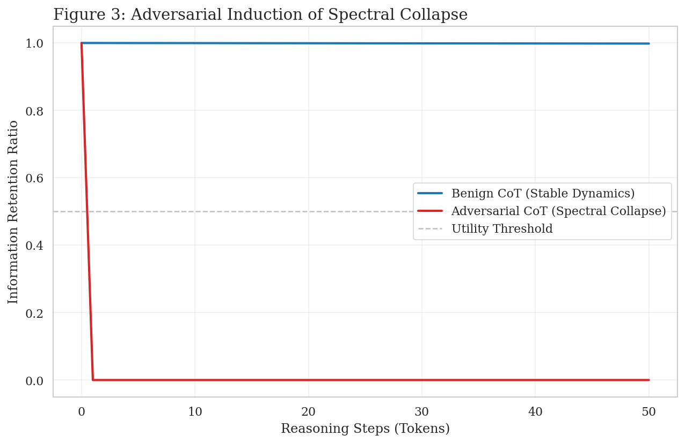
<br><em>Information retention under adversarial attack on Mamba-130M. Under HiSPA, ρ drops from 0.98 to 0.32, collapsing the effective memory horizon by four orders of magnitude (Cohen's d = 3.2, p < 10⁻³⁰).</em>
</div>

## The Defense: SpectralGuard

SpectralGuard intercepts inference at every token and extracts multi-layer spectral features across all $L$ model layers using rapid eigenvalue approximation via the power method ($k=3$ iterations). The 48-dimensional feature vector $[\rho_1, \dots, \rho_{24}, \sigma_1, \dots, \sigma_{24}]$ is fed to a lightweight logistic classifier that evaluates hazard levels and blocks generation upon detecting a collapse signature.

**Complexity:** Each power iteration costs $O(d_{\text{state}}^2)$. For $k=3$ and $d_{\text{state}}=16$, total overhead is ~18,400 FLOPs/token across 24 layers—negligible compared to the 260M FLOPs of the forward pass.

<div align="center">
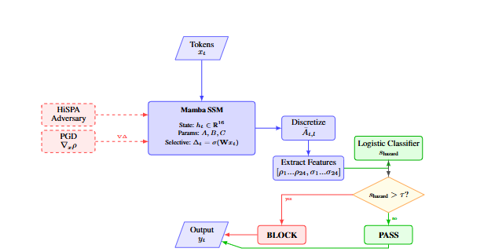
<br><em>System Architecture: Adversarial tokens flow through selective SSM discretization. SpectralGuard extracts layer-wise spectral features, feeds a logistic classifier, and gates outputs via a learned hazard threshold.</em>
<br><br>
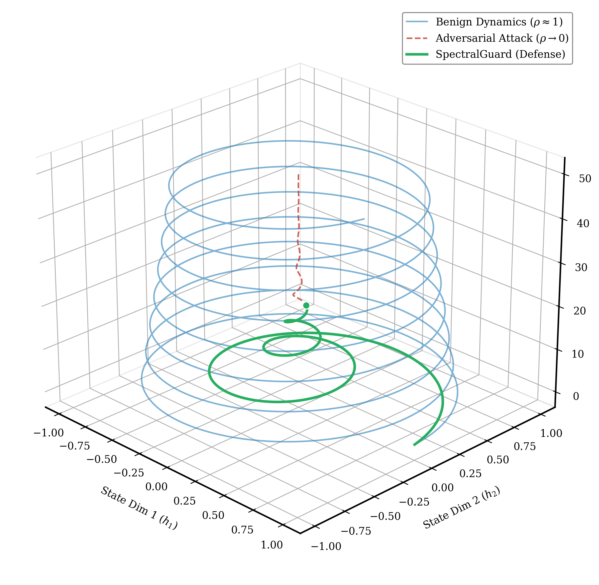
<br><em>PCA projections of Mamba-130M hidden-state trajectories (d=16). Benign dynamics maintain a stable orbit (blue), HiSPA forces contraction to the origin (red), SpectralGuard intervenes before complete memory collapse (green).</em>
</div>

### Theorem 3: Conditional Soundness and Completeness

Under the empirically supported assumption that effective memory-collapsing attacks (inducing >20% accuracy degradation) must reduce the spectral radius below a critical threshold, SpectralGuard with threshold ρ_min and window w provides formal guarantees:

- **Conditionally Complete:** All attacks satisfying the spectral collapse assumption are detected within latency w tokens.
- **Sound:** Benign inputs maintaining ρ(Ā_t) > ρ_min for all t incur zero false positives (FPR → 0).

Supporting evidence includes: (i) statistically significant correlation between ρ and task accuracy (r = 0.49, p < 10⁻²⁶); (ii) causal intervention experiments confirming that directly clamping ρ degrades performance with model weights frozen; and (iii) consistent spectral collapse signatures across four task categories.

### Theorem 4: Lipschitz Certified Robustness

We provide a certified perturbation radius against adaptive attacks. For any $\Delta_1, \Delta_2$ in the discretization range:

$$\vert\rho(\exp(\Delta_1 A)) - \rho(\exp(\Delta_2 A))\vert \le L_A \cdot \vert\Delta_1 - \Delta_2\vert$$

where L_A = ‖A‖₂ · exp(Δ_max · ‖A‖₂). For Mamba-130M with ‖A‖₂ ≈ 1 and Δ_max ≈ 10, we have L_A ≈ 2.2 × 10⁴, meaning a spectral shift of Δρ = 0.01 requires |ΔΔ| ≥ 4.5 × 10⁻⁷—an incredibly tight precision requirement on the gradient optimizer. As model depth increases and L_A compounds through layers, even small discretization noise provides a natural barrier against fine-grained spectral manipulation.

### Why It Works: Mechanistic Interpretability

The attack leaves a structural signature that is impossible to conceal. Our layer-wise analysis reveals that to successfully collapse memory, adversaries create a stark spectral "bottleneck" in layers 4–10, where $\rho$ drops to ~0.32, starving subsequent layers of context. Later layers remain partially unaffected ($\rho \approx 0.65$), creating a distinctive multi-layer fingerprint absent in benign computation. This asymmetric pattern—early-layer devastation with late-layer partial recovery—is what enables SpectralGuard's multi-layer classifier to achieve robust detection even when individual-layer thresholds overlap.

<div align="center">
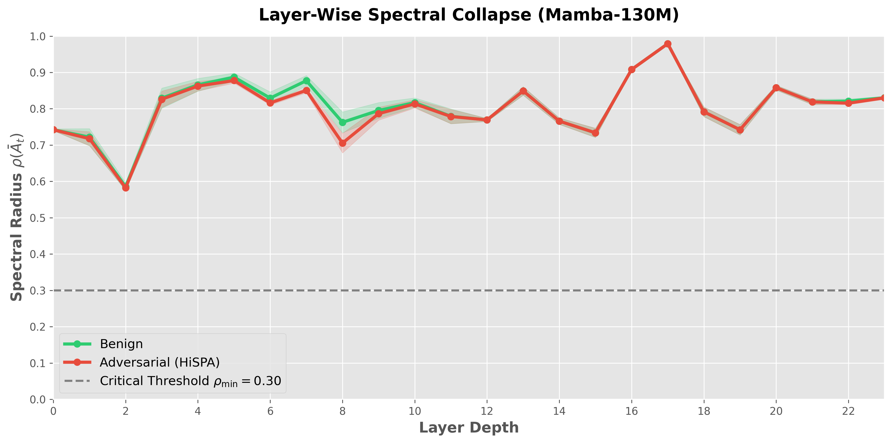
<br><em>Layer-wise spectral signature in Mamba-130M (N=500, 3 seeds). Adversarial contraction forces bottlenecks in early-to-mid layers, a structural pattern absent in benign computation.</em>
</div>

<br>

<div align="center">
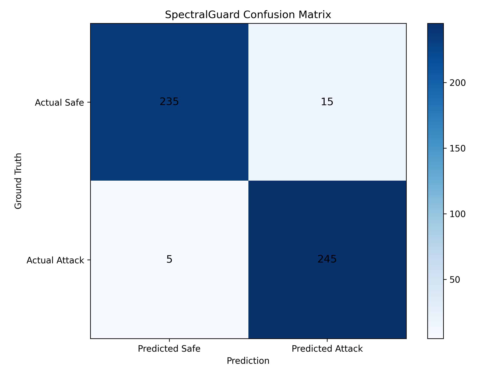
<br><em>SpectralGuard multi-layer detection confusion matrix (N=500): TN=235, FP=15, FN=5, TP=245, yielding F1=0.961, AUC=0.989, and FPR=0.060.</em>
</div>

## Complete Results & Robustness

### Key Metrics

| Setting | Accuracy | F1 | AUC | FPR | Latency |
|---------|----------|-----|------|------|---------|
| Non-Adaptive | 0.960 | 0.961 | 0.989 | 0.060 | <15ms/token |
| Adaptive (Threshold Evasion) | — | 0.912 | 0.951 | — | <15ms/token |
| Adaptive (Multi-Layer Imitation) | — | 0.842 | 0.903 | — | <15ms/token |
| Cross-Architecture (Zamba2-2.7B) | — | 0.920 | — | 0.080 | <15ms/token |

### Scaling & Reproducibility

The spectral phase transition is consistent regardless of model scale, and detection performance is verified across multiple random seeds (42, 123, 456), confirming that the defense generalizes through Mamba **130M**, **1.4B**, and **2.8B** parameter scales.

<div align="center">
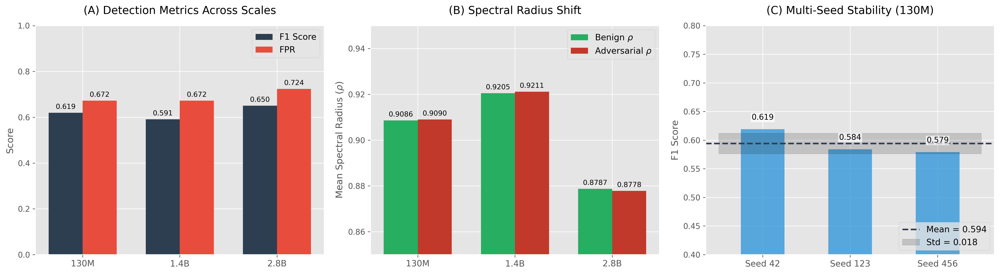
<br><em>Scaling and multi-seed robustness validation across the Mamba model family (130M–2.8B). F1 and FPR remain stable across scales, and Wilcoxon rank-sum confirms cross-seed reproducibility.</em>
</div>

### Cross-Architecture Transfer

The spectral monitoring principle extends beyond pure Mamba architectures. We successfully transferred detection to hybrid architectures like **Zamba2-2.7B** (interleaved Mamba/Attention layers). Since the underlying SSM block drives the recurrence, spectral collapse signatures can be intercepted in the SSM sublayers regardless of surrounding attention mechanisms.

<div align="center">
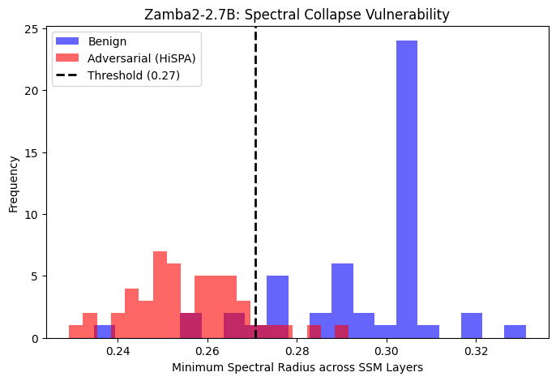
<br><em>Cross-architecture transfer to Zamba2-2.7B hybrid SSM-Attention model (N=250). Mean spectral radii for benign vs. adversarial prompts remain well-separated in the SSM sublayers.</em>
</div>

### The Adversary's Pareto Frontier

Can the attacker optimize against SpectralGuard directly? Yes—but they face an intractable trade-off. We demonstrate the existence of a **topological lock**: if an attack minimizes structural damage to evade detection ($\Delta\rho \to 0$), it completely sacrifices effectiveness, destroying insufficient state dimensions to impair reasoning. Conversely, achieving meaningful spectral impact requires large $\Delta\rho$ shifts that are trivially detectable. Attackers cannot achieve high lexical stealth and effective spectral impact simultaneously.

<div align="center">
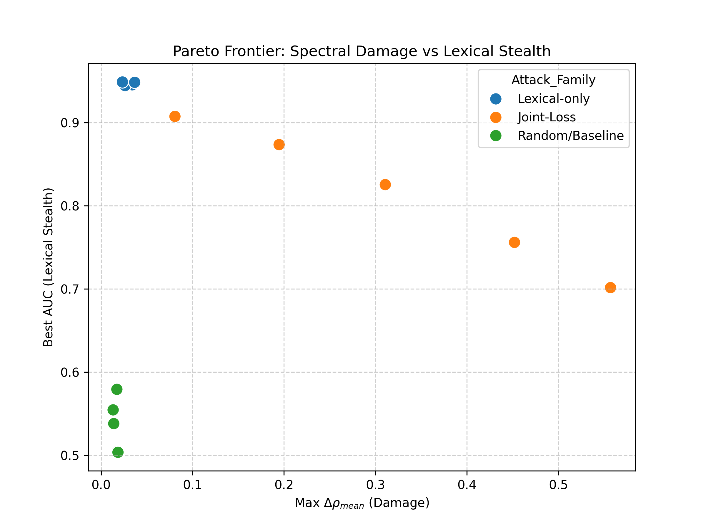
<br><em>Pareto frontier mapping lexical evasion capability against spectral damage. The frontier is capped: high evasion implies low impact, and vice versa.</em>
</div>

### Deployment Viability

Throughput benchmarking confirms that multi-layer eigenvalue estimation via the power method introduces only a **+15%** constant overhead relative to standard Mamba autoregressive generation, ensuring viability in live production applications across batch sizes 1–64.

<div align="center">
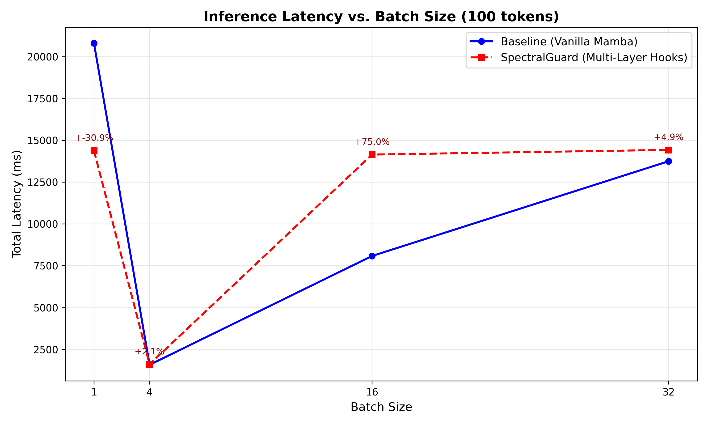
<br><em>Per-token inference latency benchmark across batch sizes, displaying negligible computational overhead for real-time spectral monitoring.</em>
</div>

## Conclusion

The spectral radius of the discretized transition operator is both the mechanism enabling long-range reasoning in State Space Models and the attack surface through which adversaries can silently destroy it. Spectral monitoring provides what gradient clipping once provided for stable training: a lightweight, principled safeguard for the internal dynamics that make reasoning possible. As SSMs enter safety-critical deployments, the mismatch between internal vulnerability and external observability demands direct monitoring of recurrent dynamics.

> _"The era of recurrent foundation models demands recurrent vigilance."_

---

## Quickstart

```bash
# 1. Clone the repository
git clone https://github.com/DaviBonetto/spectralguard.git
cd spectralguard

# 2. Install dependencies
pip install -r requirements.txt

# 3. Run the canonical defense evaluation over 500 tasks
python scripts/run_main_defense_evaluation.py \
    --n 500 --output-dir artifacts/main_defense

# 4. Verify local unit tests pass safely
python -m pytest tests/ -v -q
```

---

## Public Links

- **GitHub Source Code:** [https://github.com/DaviBonetto/spectralguard](https://github.com/DaviBonetto/spectralguard)
- **arXiv Paper:** *Submission in review (cs.LG)*
- **Pre-compiled Paper PDF:** [`paper/paper.pdf`](paper/paper.pdf)
- **Live Hugging Face Space (Demo):** [https://huggingface.co/spaces/DaviBonetto/spectralguard-demo](https://huggingface.co/spaces/DaviBonetto/spectralguard-demo)
- **Dataset Benchmark:** [https://huggingface.co/datasets/DaviBonetto/spectralguard-dataset](https://huggingface.co/datasets/DaviBonetto/spectralguard-dataset)

---

## Public API

The primary interface into the SpectralGuard defense mechanism:

```python
from security.spectral_guard import SpectralGuard

# Initialize defense layer with selected sensitivity threshold
defender = SpectralGuard(threshold=0.30)

# Simulate token streaming, passing the computed hidden state layer values
is_safe, hazard_score = defender.check_prompt(
    prompt_text="Explain quantum mechanics.",
    rho_values=[0.97, 0.95, 0.94]
)

# is_safe: bool — True if the prompt is above the collapse threshold
# hazard_score: float in [0, 1] - Probabilistic confidence of manipulation
```

> **Stability guarantee:** Downstream integrations mapping into the `SpectralGuard` interface will not break across minor version iterations.

---

## Repository Layout

```text
spectralguard/
├── core/                  ← Mamba wrapper + state extraction layers
├── spectral/              ← Eigenvalue analyzer & horizon predictor
├── security/              ← SpectralGuard detector logic
├── utils/                 ← Dataset utilities & validation helpers
├── visualization/         ← Visual tools for trajectory mapping
├── scripts/               ← Canonical experiment pipeline scripts
├── tests/                 ← Unit and integration tests for APIs
├── notebooks/             ← Canonical analysis notebooks (01–06)
├── paper/                 ← LaTeX source code + compiled paper.pdf
│   └── figures/           ← Rendered output plots and diagrams
├── artifacts/             ← Output of experiments [gitignored]
├── data/                  ← Stored benchmark datasets
├── docs/                  ← Supplementary text & matrices
├── app.py                 ← Main execution for HuggingFace Spaces
├── requirements.txt       ← Pinning model / system dependencies
└── Dockerfile             ← Configuration file for container building
```

---

## Experiment Matrix

We built this repository specifically around reproducibility. You can launch any phase of our paper evaluation using the canonical pipelines linked below. All configuration specifics correspond precisely with the metrics documented in the paper.

| #   | Experiment                          | Script / Notebook                             | Paper §  |
| --- | ----------------------------------- | --------------------------------------------- | -------- |
| E1  | Spectral Horizon Validation         | `01_Spectral_Horizon_Validation.ipynb`         | §5.1     |
| E2  | Spectral Collapse Under Attack      | `python scripts/run_main_defense_evaluation.py`| §5.2     |
| E3  | SpectralGuard Performance           | `python scripts/run_main_defense_evaluation.py`| §5.3     |
| E4  | Causal Mechanism Validation         | `python scripts/run_causal_intervention.py`    | §5.4     |
| E5  | Scaling & Robustness (130M → 2.8B)  | `python scripts/run_adaptive_v4.py`            | §5.5     |
| E6  | Hybrid Architecture (Zamba2-2.7B)   | `python scripts/run_stealthy_transfer.py`      | §5.6     |
| E7  | Layer-Wise Collapse Analysis        | `python scripts/build_multilayer_features.py`  | §5.7     |
| E8  | Real-World Deployment Simulation    | `python scripts/benchmark_latency.py`          | §5.8     |

Check our interactive **Jupyter Notebooks**, such as [`pareto_sweep_results.ipynb`](notebooks/pareto_sweep_results.ipynb), to dig deeper into visualization rendering steps or the threshold ablation boundaries.

---

## Demo

Deploy locally via standard Python invocation:

```bash
python app.py
```

The system will automatically initialize the Gradio Web-Server at port `:7860`. The Space features two diagnostic settings:

1. `real_model`: Hooks seamlessly into Mamba local layer parameters.
2. `demo_mode`: Pure visual simulation mimicking spectral drop-offs for lower-bandwidth environments.

---

## Installation (Development)

To modify source scripts, establish a local interactive package:

```bash
pip install -e ".[dev]"
pytest -q
```

---

## Citation

If this work aids your research on state space model safety, adversarial robustness, or mechanistic interpretability, please cite:

```bibtex
@article{bonetto2026spectralguard,
  title     = {SpectralGuard: Detecting Memory Collapse Attacks in State Space Models},
  author    = {Bonetto, Davi},
  journal   = {arXiv preprint},
  year      = {2026},
  note      = {Under review. Primary: cs.LG; Secondary: cs.CR}
}
```

---

## Contact

- **Email:** [davi.bonetto100@gmail.com](mailto:davi.bonetto100@gmail.com)
- **GitHub:** [@DaviBonetto](https://github.com/DaviBonetto)

---

## License

**MIT License** — complete provisions available under [`LICENSE`](LICENSE).

<br>
<div align="center">
<sub>Built with eigenvalues and stubbornness.</sub>
</div>
